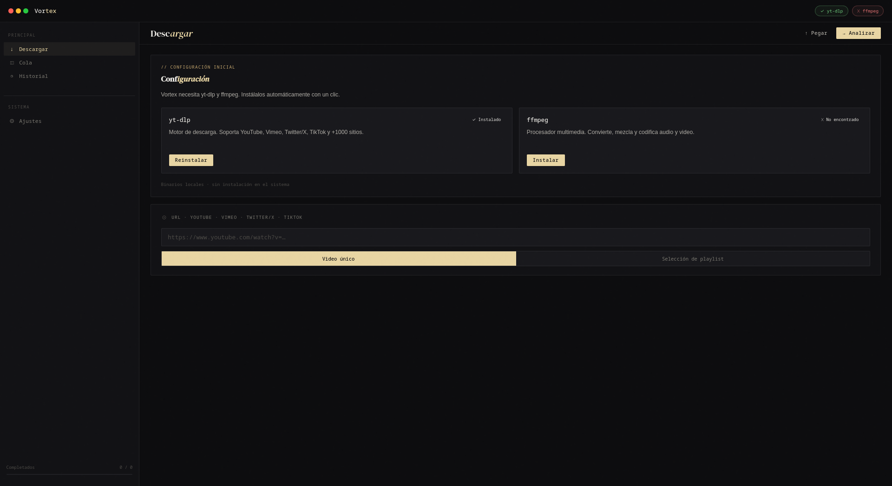
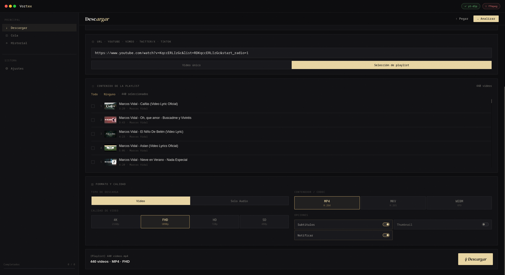
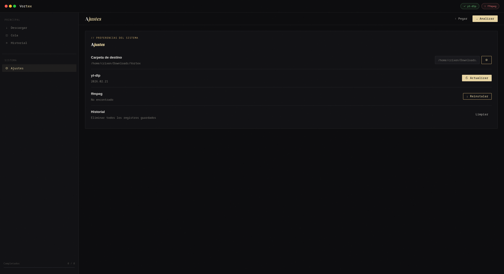

<div align="center">

# VORTEX

**YouTube & web video downloader with a clean GUI**

Powered by [yt-dlp](https://github.com/yt-dlp/yt-dlp) and [ffmpeg](https://ffmpeg.org/) · Built with [Electron](https://www.electronjs.org/)

</div>

---

## Screenshots

<!-- Main window -->
> **Main view**
>
> 

---

<!-- Downloading in progress -->
> **Download in progress**
>
> 

---

<!-- Playlist selection -->
> **Playlist selection**
>
> 

---

<!-- Settings / tools panel -->
> **Settings & tools**
>
> 

---

## Features

- Download videos and audio from YouTube and 1000+ sites supported by yt-dlp
- Choose quality: 4K, 1080p, 720p, 480p, 360p
- Choose format: MP4, MKV, WebM, MP3, M4A, OPUS, FLAC, WAV
- Playlist support: select individual items or download all at once
- Thumbnail preview with modal zoom
- Download queue with progress tracking
- Download history (last 60 items, persisted locally)
- Retry and cancel individual downloads
- Auto-install yt-dlp and ffmpeg — no manual setup required
- Update yt-dlp from within the app
- Custom output directory
- Frameless window with custom title bar

## Requirements

- Linux (primary target), Windows or macOS
- Node.js + pnpm (for development)
- yt-dlp and ffmpeg — installed automatically on first run

## Installation

### Pre-built (Linux)

Download the latest `.AppImage` from the [Releases](https://github.com/crixeen/vortex/releases) page, make it executable and run it:

```bash
chmod +x VORTEX-*.AppImage
./VORTEX-*.AppImage
```

### From source

```bash
git clone https://github.com/crixeen/vortex.git
cd vortex
pnpm install
pnpm start
```

## Build

```bash
pnpm build   # produces an AppImage in dist/
```

## Development

```bash
pnpm start    # run in development mode
pnpm format   # format code with Prettier
```

## How it works

1. Paste a URL and click **Analyze** — VORTEX calls `yt-dlp --dump-json` to fetch metadata.
2. Pick quality, format, and codec, then click **Download**.
3. The main process spawns `yt-dlp` with the appropriate format selectors and streams progress back to the UI.
4. Binaries are auto-downloaded to `~/.local/share/vortex/bin/` on first use.

## License

MIT © [Crixeen](https://github.com/crixeen)
